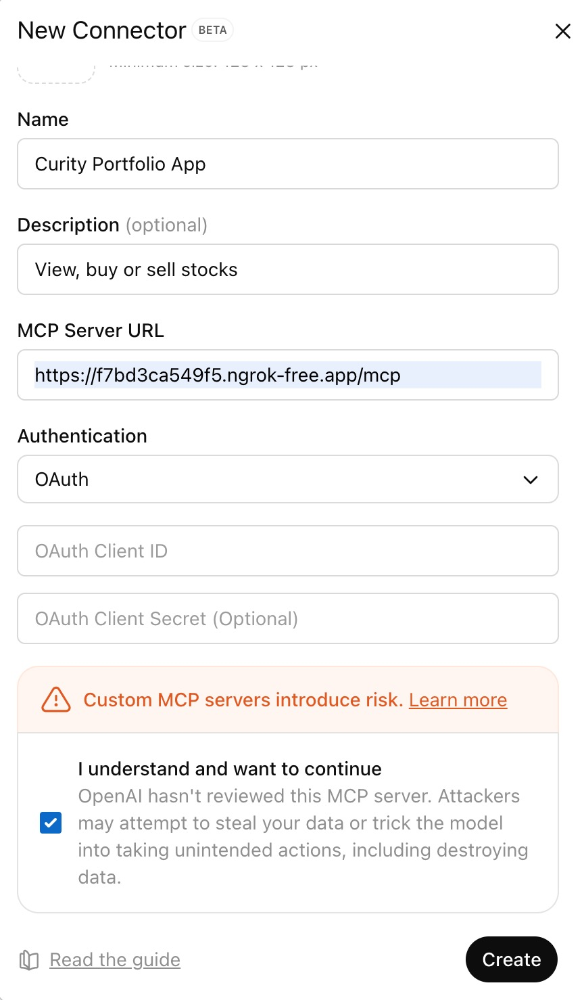
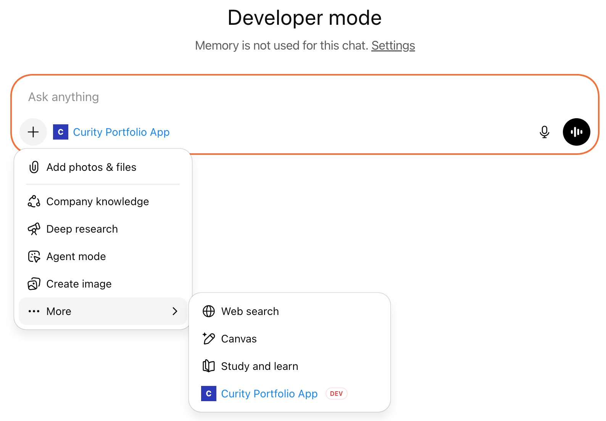

# Deployment

These notes explain how to deploy and test the MCP server.

## Prerequisites

You need the following tools on your computer in order to run the deployment.\
The ngrok tool exposes the MCP server and the Curity Identity Server to the internet.\
ChatGPT can then connect to components running on the local computer.

- Docker
- Node.js 22+
- Maven
- ngrok
- curl
- jq
- envsubst

You also need the following free resources:

- An [ngrok account and auth token](https://dashboard.ngrok.com/get-started/your-authtoken)
- A [trial license for the Curity Identity Server](https://developer.curity.io/) with access to the HAAPI feature

## Build the code

First, build the project files by running the following command:

```shell
./build.sh
```

## Use MCP Server Configuration

The MCP server uses the following environment variables as configuration settings.\
You can use all default values to run a working deployment.

- `PORT` - port on which the MCP server is started. If you change this setting, make sure to also change `apigateway/kong.yml` to point to the correct port.
- `HAAPI_CLIENT_ID` and `HAAPI_CLIENT_PASSWORD` — credentials of the OAuth client that performs the HAAPI flow.
- `EXTERNAL_BASE_URL` — the external base URL of the MCP server
- `API_URL` — the base URL of the API. This could be an internal or external URL depending on where you deploy the MCP server. 
- `AUTHORIZATION_SERVER_BASE_URL` — the base external URL of the authorization server
- `TOKEN_ENDPOINT` — the authorization server's token endpoint URL. This could be an internal or external URL depending on where you deploy the MCP server.
- `AUTHORIZATION_ENDPOINT` — the authorization server's authorization endpoint URL. This could be an internal or external URL depending on where you deploy the MCP server.
- `SCOPE` — the scope that the MCP client will receive in its' access tokens and for which the MCP server will ask when running the HAAPI flow.
- `REDIRECT_URI` — the redirect URI that the MCP server has registered at the authorization server. This URL is not used to make any redirects, but needs to match the URI registered in the authorization server.
- `AUTHN_SERVER_BASE_URL` — the base URL for the HAAPI flow. This could be an internal or external URL depending on where you deploy the MCP server.
- `EXTERNAL_AUTHN_SERVER_BASE_URL` — the external base URL for the HAAPI flow. The external URL is used in DPoP tokens.
- `ACR` — the authentication method that should be used in the HAAPI flow. See below.

## Deploy Backend Components

Then, start all the Docker containers by running the following commands.\
Supply an ngrok auth token and the path to your Curity Identity Server license file.

```shell
export NGROK_TOKEN=1oLFIAYu7ZS0lD5S....
export LICENSE_FILE_PATH=~/Desktop/license-trial.json
./deploy.sh
```

The deployment outputs the URL of a secured MCP server:

```text
Use the following MCP Server URL to connect: https://815faa4bc463.ngrok-free.app/mcp
```

Later, once you've finished testing, run this command to free all Docker resources:

```shell
./teardown.sh
```

## Configure ChatGPT

Log in to ChatGPT's web interface with a paid account that has access to **Developer Mode**.\
In ChatGPT's web interface, go to **Settings** -> **Apps and Connectors** -> **Advanced** and enable **Developer Mode**.\
Use the MCP server URL to create a new App from the **Apps and Connectors** panel:



Then, select the MCP server as an application



## View MCP Requests

You can also follow the [MCP Inspector README](clients/mcp-inspector/README.md) to test with that tool.\
Doing so enables you to take a closer look at MCP requests and responses.

## Handle Redeployments

If you restart the Curity Identity Server container, update any tools, tool descriptions, templates, or assets you need to delete the application from chatGPT and create a new one. This will force a new client registration from ChatGPT. There is a "Refresh" button on in the Apps settings panel, which might refresh some of this data. If you run to connectivity issues it might be sometimes necessary to reconnect the app. You can do it from the **Apps and Connectors** panel.
