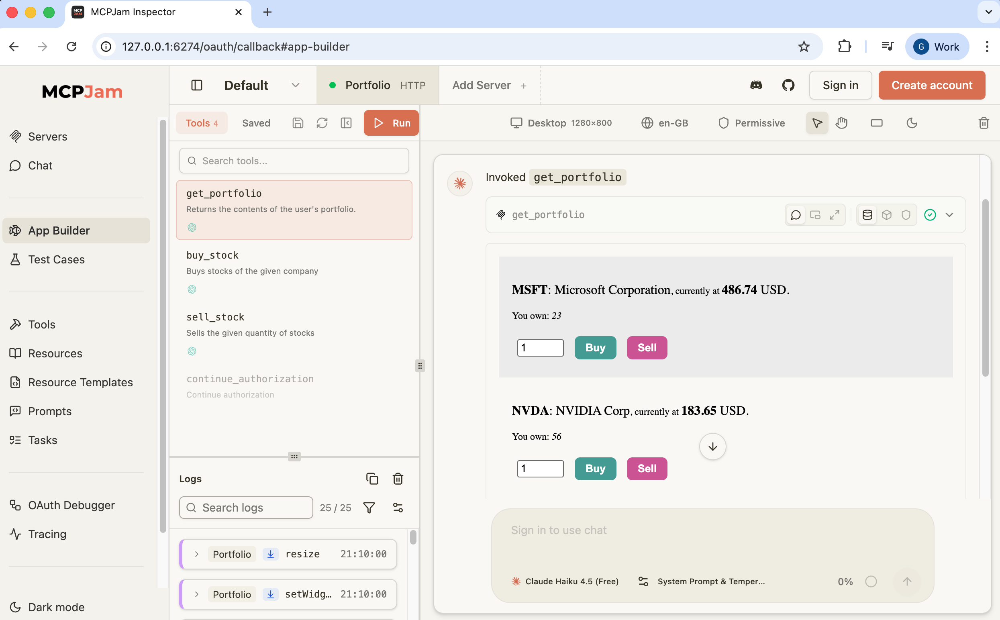

# Local Development

These notes explain how to run components locally, with other components running in Docker.\
First, run the [Deployment](DEPLOYMENT.md) to ensure that you meet prerequisites.

## Develop the ChatGPT Widget App

To develop the ChatGPT widget app, serve its web assets in watch mode.\
The MCP server serves the widget from the `mcp-server/widget/dist` folder on the host computer.

```shell
cd mcp-server/widget
npm run watch
```

Consider running the widget in a development MCP host that can render widget apps, such as the [MCPJam Inspector](https://github.com/MCPJam/inspector):

```bash
npx @mcpjam/inspector@latest
```

Navigate to `Servers` and add the MCP server's ngrok URL and run the OAuth flow when prompted.\
Then navigate to `App Builder`, run the `get_portfolio` tool and interact with the widget app:



## Develop the MCP Server

Override URLs so that the API gateway of the deployed system routes to the local computer.\
Then re-run the deployment with a local development routing:

```bash
export MCP_SERVER_HOST=host.docker.internal
export PORTFOLIO_API_HOST=host.docker.internal
./build.sh
./deploy.sh
```

To develop the MCP server, run it locally on port 8081 and point to a local Portfolio API:

```shell
cd mcp-server
npm start
```

In another terminal window, run the Portfolio API on port 8080:

```bash
cd portfolio-api
npm start
```
