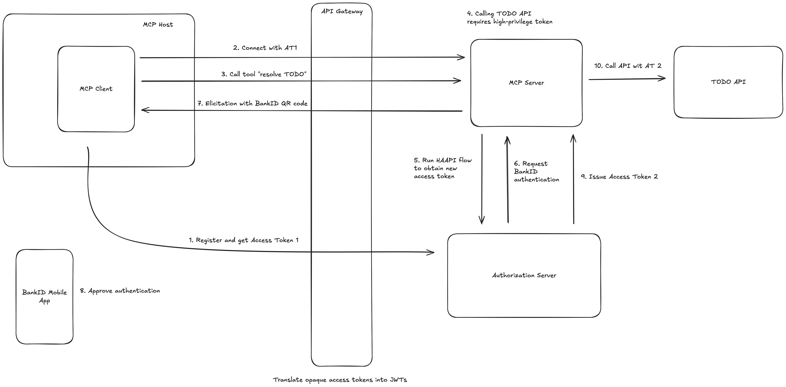

# Example ChatGPT App (Todo app)

[](https://curity.io/resources/code-examples/status/)
[](https://curity.io/resources/code-examples/status/)

An example that shows how an AI application can securely call APIs with elevated permissions and human-in-the-loop.

## Prerequisites

You need the following tools on your computer in order to run the example:

- maven
- docker
- node and npm (node, at least v22)

You also need a valid license to run the Curity Identity Server. Make sure you have the license file locally and point the `LICENSE_FILE_PATH` environment variable to it. For example:

```shell
export LICENSE_FILE_PATH=/license/license.json
```

## Overview

The example consists of the following components:

- **MCP Server** — an OAuth-protected MCP server, that is capable of exchanging access tokens using HAAPI, and implements tools for calling the Todo API.
- **The Curity Identity Server** — serves as the authorization server which protects both access to the MCP Server and to the APIs. It is also responsible for authenticating users.
- **Todo API** — a simple API to manage a list of to-dos. It exposes endpoints for listing the tasks and marking them either as done or undone. The API is protected with OAuth access tokens.
- **API Gateway** — the Kong API gateway is used for the phantom token flow — it exchanges opaque access tokens handled by the MCP client into JWTs required by the MCP server.

The following diagram shows an overview of an end-to-end flow implemented in this example:



## Running the Example

Follow these steps to run the example:

1. Add the following line into your local `/etc/hosts` file (or equivalent for your operating system):

```
127.0.0.1 api.demo.example mcp.demo.example admin.demo.example login.demo.example mail.demo.example
```

2. Make sure the `LICENSE_FILE_PATH` environment variable points to a license for the Curity Identity Server. For example:

```shell
export LICENSE_FILE_PATH=/license/license.json
```

3. Build the project files by running the following command from the project's root directory:

```shell
./build.sh
```
4. Start all the Docker containers by running the following command from the project's root directory:

```shell
./deploy.sh
```

Once you're finished working with the project, use the following command from the project's root directory to free up resources:

```shell
./teardown.sh
```

## Testing the End to End Flow

To test the complete flow, you need to use a compatible MCP client. See the options below for instructions on how to use some popular clients.

The initial setup comes with a pre-registered user account. Use `jogn.doe@demo.example` whenever prompted for an email. The email authenticator will send a one-time-password to the user's email. This example uses a local maildev server to catch all outgoing emails. Navigate to `https://mail.demo.example` to access the dev inbox. You will see all the OTP emails there.

### Test with MCP Inspector

The simplest way is to test the solution with the MCP inspector tool. See the [MCP Inspector readme](clients/mcp-inspector/README.md) for details of installing and running the tool.

### Test with Claude Desktop

// TODO

## Development

See [DEVELOPMENT.md](docs/DEVELOPMENT.md) for details on how to work with the code locally.

## Work In Progress

See the [Work In Progress](docs/WIP.md) document to read about further planned development of this example.
