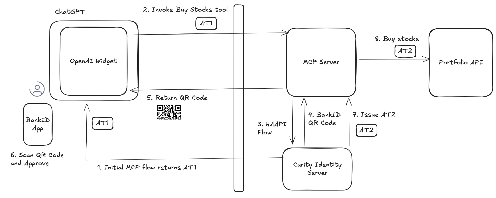

# Example ChatGPT App Widget with MCP Security

[](https://curity.io/resources/code-examples/status/)
[](https://curity.io/resources/code-examples/status/)

An example that shows how a ChatGPT widget can securely call APIs with human-in-the-loop approval.\
The Hypermedia Authentication API enables step-up authentication with a simple user experience.

## Security Flow

The following diagram shows an overview of the example's main security flow:



ChatGPT's MCP client triggers user authentication with the system browser.\
The MCP client then receives an initial low-privilege access token.\
The MCP server returns an HTML widget as an MCP resource.\
The widget's JavaScript calls an MCP tool to get portfolio data and render it.


The user can interact with the widget to invoke a tool to buy or sell stocks.\
The tool triggers a server side API-driven authentication flow using the Hypermedia Authentication API.\
The tool returns BankID's animated QR code to the widget, which polls the MCP server for completion.\
The user authenticates with BankID to approve the transaction and the widget renders an updated balance.


## Deploy the System

You need the following tools on your computer in order to run the deployment.\
The ngrok tool exposes the MCP server and the Curity Identity Server to the internet.\
ChatGPT can then connect to components running on the local computer.

- Docker
- Node.js 22+
- Maven
- ngrok
- curl
- jq
- envsubst

You also need the following free resources:

- An [ngrok account and auth token](https://dashboard.ngrok.com/get-started/your-authtoken)
- A [trial license for the Curity Identity Server](https://developer.curity.io/) with access to the HAAPI feature

First, build the project files by running the following command:

```shell
./build.sh
```

Then, start all the Docker containers by running the following commands.\
Supply an ngrok auth token and the path to your Curity Identity Server license file.

```shell
export NGROK_TOKEN=1oLFIAYu7ZS0lD5S....
export LICENSE_FILE_PATH=/Desktop/license-trial.json
./deploy.sh
```

The deployment outputs the URL of a secured MCP server:

```text
Use the following MCP Server URL to connect: https://815faa4bc463.ngrok-free.app/mcp
```

Later, once you've finished testing, run this command to free all Docker resources:

```shell
./teardown.sh
```

## ChatGPT Setup

Log in to ChatGPT's web interface with a paid account that has access to **Developer Mode**.\
In ChatGPT's web interface, go to **Settings** -> **Apps and Connectors** -> **Advanced** and enable **Developer Mode**.\
Use the MCP server URL to create a new App from the **Apps and Connectors** panel:


Then, select the MCP server as an application


## Initial User Login

ChatGPT's MCP client triggers an MCP authorization flow that requires email verification.\
Enter the email `john.doe@demo.example` and use a one-time code from the test inbox at `http://localhost:1080`.\
The user then consents to ChatGPT's level of data access:


## Admin UI for the Curity Identity Server

Connect to the Admin UI with the following details:

- URL: `http://localhost:6749/admin`
- Username: `admin`
- Password: `Password1`

## View MCP Requests with MCP Inspector

You can also follow the [MCP Inspector README](clients/mcp-inspector/README.md) to test with that tool.\
Doing so enables you to take a closer look at MCP requests and responses.

## Redeployments

If you restart the Curity Identity Server container, update any tools, tool descriptions, templates, or assets you need to delete the application from chatGPT and create a new one. This will force a new client registration from ChatGPT. There is a "Refresh" button on in the Apps settings panel, which might refresh some of this data. If you run to connectivity issues it might be sometimes necessary to reconnect the app. You can do it from the **Apps and Connectors** panel.

## Development

- See [DEVELOPMENT.md](docs/DEVELOPMENT.md) for details on how to work with the code locally.
- See the [Work In Progress](docs/WIP.md) document to read about components that are in progress.
