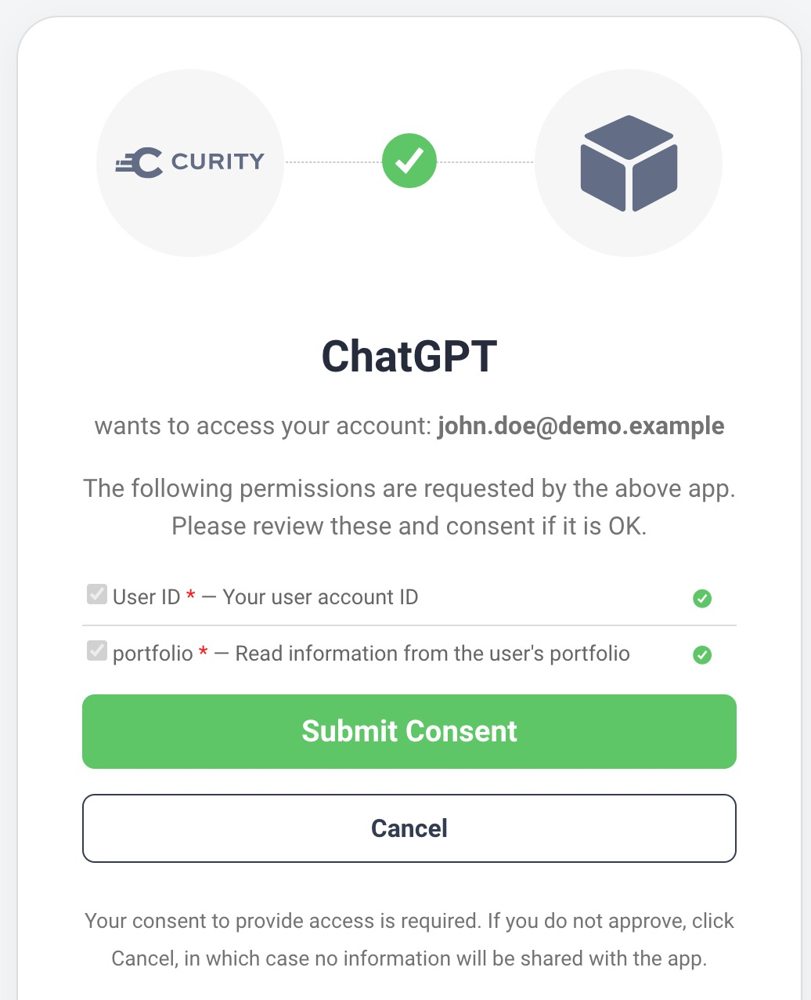
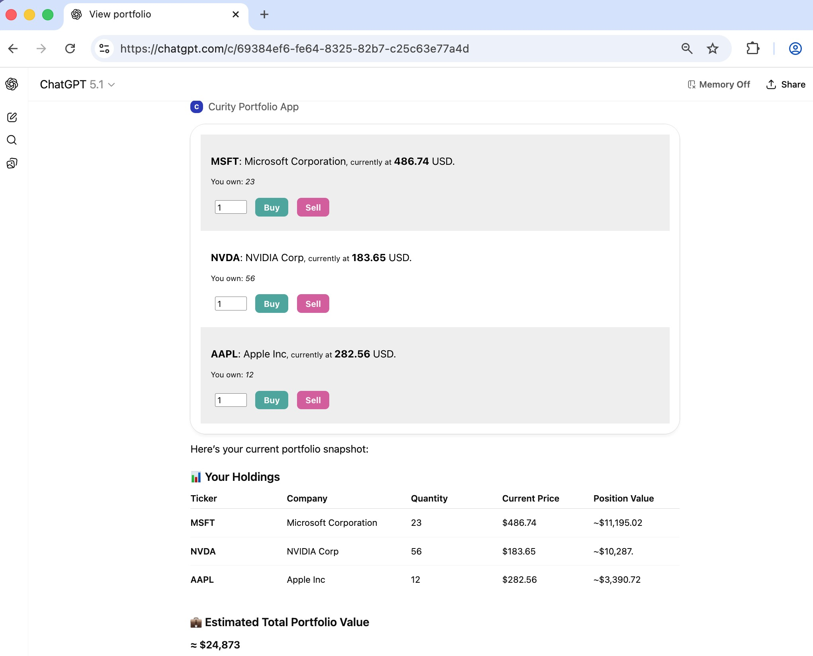
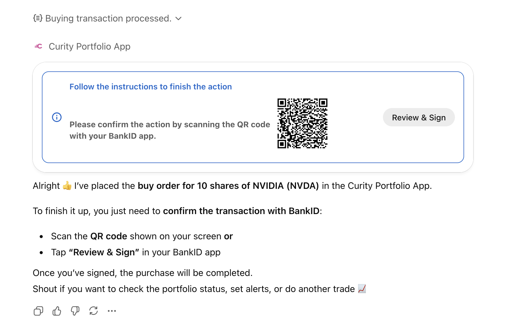
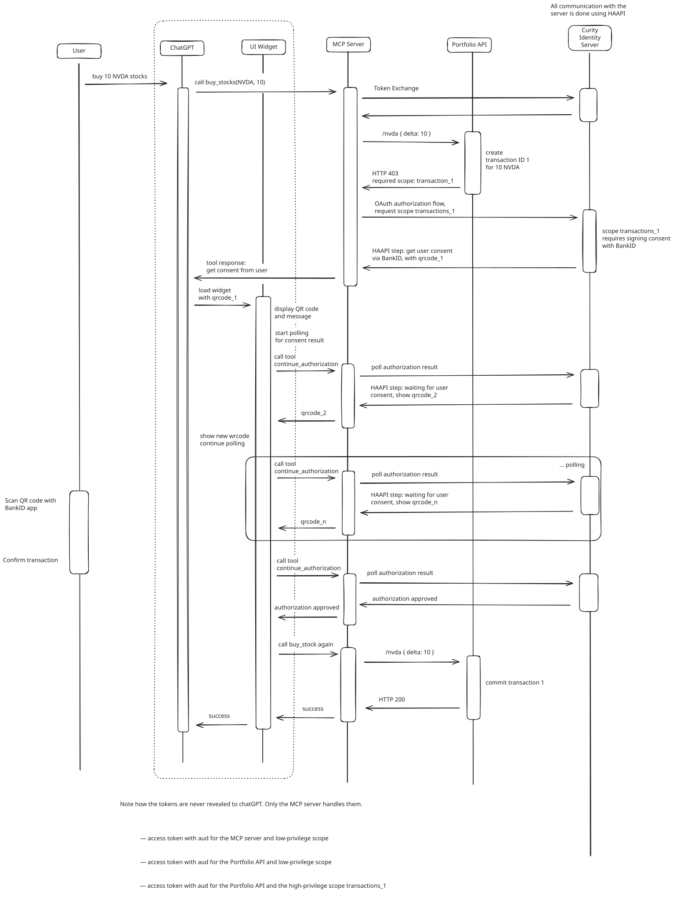

# ChatGPT App with MCP Step-Up Authentication

An example that shows how a ChatGPT widget can securely call APIs with human-in-the-loop approval.\
The Hypermedia Authentication API enables step-up authentication with a simple user experience.

## Initial User Login Flow

ChatGPT's MCP client first triggers user authentication for the test user `john.doe@demo.example`.\
Get a one-time code for the test user from the test email inbox at `http://localhost:1080`.\
Next, consent to ChatGPT's level of data access and ChatGPT receives a low privilege access token.

ChatGPT then downloads the widget app as an MCP resource and runs it in an iframe.\
The widget's JavaScript calls an MCP tool to get portfolio data and render it.

## Step-Up Authentication Flow

The user can interact with the widget to invoke a tool to buy or sell stocks.\
When the user initiates a high privilege buy or sell operation it triggers a step up flow:

The tool triggers a server side API-driven authentication flow using the Hypermedia Authentication API.\
The tool returns BankID's animated QR code to the widget, which polls the MCP server for completion.\
The user authenticates with BankID to approve the transaction and the widget renders an updated balance.

The MCP server's HAAPI flow gets a high privilege access token that never leaves the backend environment.\
First, an [Access Token Authenticator](https://github.com/curityio/access-token-authenticator) sets the authenticated subject from the low privilege access token.\
Next, BankID captures human approval before the Curity Identity Server issues the high privilege access token.\
The MCP server then calls the Portfolio API with the high privilege access token to complete the transaction.

## View Security Configuration

Run the Admin UI for the Curity Identity Server to view the OAuth security settings:

- URL: `http://localhost:6749/admin`
- Username: `admin`
- Password: `Password1`

## Further Information

See the following resources for further information and tutorials:

- See the [Deployment README](DEPLOYMENT.md) to learn how to run the example and test end-to-end.
- See the [Development README](DEVELOPMENT.md) to learn how to run the MCP server code locally.
- See the [Secure an OpenAI ChatGPT App](https://curity.io/resources/learn/chatgpt-widget-haapi) for a tutorial that explains this code's security flow in depth.
- See the [Access Token Authenticator Plugin](https://github.com/curityio/access-token-authenticator) to learn how to use an access token as an authentication factor.
- Please visit [curity.io](https://curity.io/) for more information about the Curity Identity Server.
